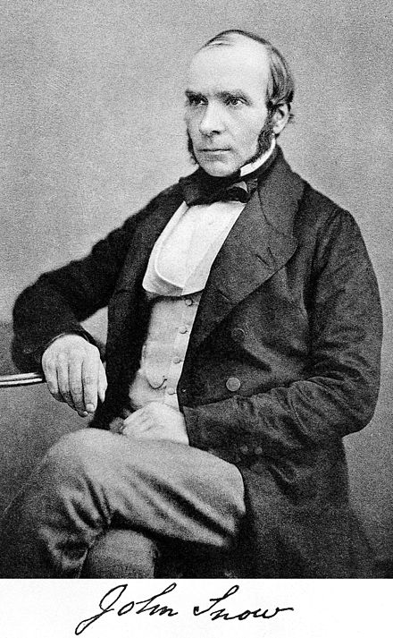

class: my-one-page-font

# Epidemiyoloji Nedir?

--

- *Neden bu soruyla başlıyoruz? Sağlık sosyolojisinin ortaya çıkışı üzerine konuşmayacak mıyız?* 

--

- Epidemiyoloji: Toplumdaki hastalık, kaza ve sağlıkla ilgili durumların *dağılımını*, *görülme sıklıklarını* ve bunları etkileyen *faktörleri* inceleyen bilim dalıdır.


--

- Temel odak noktası: bireyler değil, toplumsal grupların sağlık problemleridir.

--

- Sosyal epidemiyoloji: biyolojik faktörlere değil, sosyal faktörlere göre dağılım. 

---

class: my-one-page-font

# Epidemiyoloji: Tarihsel Bakış 

--

- Epidemiyoloji: epidemic -> "salgın hastalık"  
*Tarihte salgın hastalıklara örnekler nelerdir?*

--

-Bubonik veba (kara veba): 1347-1750.   
-Tahminen Avrupa nüfusunun üçte birini öldürdü (20 milyon).  
-*Nasıl sona erdi?*

--

- Kara veba gibi salgın hastalıklar tarih boyunca var olmasına rağmen epidemiyoloji 19. yüzyıla kadar sistematik bir faaliyet olarak ortaya çıkmadı. Ta ki...

---

class: my-one-page-font

# Epidemiyoloji: Tarihsel Bakış 

```{r bd, eval=TRUE, echo=FALSE, out.height=500, out.width=750, fig.align="center"}
knitr::include_graphics("/p5.png")
```


---

class: my-one-page-font

# Epidemiyoloji: John Snow

--

.pull-left[

- Winterfell'den geliyor.

- Doğuştan lider.

- Yakışıklı ama şaşkın bakıyor.

- Hâlâ hayatta.

- Jon ~~John~~ Snow

- *Ne? Game of Thrones izlemediniz mi?*

]

.pull-right[

]

---

class: my-one-page-font

# Epidemiyoloji: John Snow

--

.pull-left[

- 1854 Londra kolera salgını

- Kolera vakalarını takip etmeye başlar: ne yedikleri, içtikleri, nerelere gittikleri, hangi aktivitelerde bulundukları

- *Peki ne keşfeder?*

]

.pull-right[

]

---

class: my-one-page-font

# Epidemiyoloji: John Snow


- Snow, zamanla koleranın içme suyu yoluyla bulaştığından şüphelenmeye başlar. *Çözüm?*

--
```{r img, eval=TRUE, echo=FALSE, out.height=450, out.width=450, fig.align="center"}
knitr::include_graphics("/p3.jpg")
```
---

class: my-one-page-font

# Epidemiyoloji: John Snow

- Snow, Broad sokağındaki su pompasının kaldırılmasını teklif eder. Pompa kaldırılınca salgın durur (?). 

--

- **1.ders**: toplumsal davranış ve çevrenin önemi.

--

- Ayrıca bizim için bir ders daha var: John Snow bir dedektif gibi çalışır.

--

- Epidemiyolojinin ilgilendiği etmenler:   
(1) biyolojik etmenler (bakteri, virüs),   
(2) beslenmeyle ilgili etmenler (yağ ve karbonhidrat – kolestrol),   
(3) kimyasal etmenler (gazlar, toksik materyaller),   
(4) fiziksel etmenler (iklim, bitkiler),   
(5) **sosyal etmenler (iş koşulları, toplumsal sınıf, yaşam alanı)**  

---


class: my-one-page-font

# Epidemiyolojiden Sosyolojiye

- *Toplumsal çevre ne demek?* 

--

- İnsanların yaşam şartları: barınma, beslenme, güvenlik vs. 

--

- *Ayrıca* sosyal ve kültürel bağlamı yansıtan normlar, değerler ve tutumlar: bunlar insan davranışlarını etkiler (hijyen pratikleri, yemeklerin hazırlanma şekli vs.)

--

- Koleraya sebep olanın bir bakteri (*vibrio cholerae*) olduğunu söyleyebiliriz. 
--

- **Ancak toplumsal çevre salgının ortaya çıkması ve yayılması için gerekli koşulları yaratır.**  

---

class: my-one-page-font

# Sağlık Sosyolojisi

- Ve sosyologlar sağlık konusuyla yakından ilgilenmeye başlarlar... 

--

- ***Pek sayılmaz.***

--

- Konuyla ilk ilgilenenler tıp doktorları (1800'lerin sonları): ilk makaleler, kitaplar, konferanslar tıp doktorlarının etkinliğiyle gerçekleşiyor. 

--

- 1900'lerin başlarında sosyologların ilgisi hala sınırlı. Ancak 2. Dünya Savaşı sonrası konuyu ciddi bir şekilde ele almaya başlıyorlar. *Neden?*

--

- Bu dönemde önemli bir isim sosyolog Talcott Parsons, ancak bu konuyu haftaya ele alacağız. Şimdi...

---

class: my-one-page-font

# Epidemiyolojik Geçiş

- Sosyologlar konuyla ilgilenmeye yeni yeni başladıklarında önemli bir değişiklik (geçiş) meydana gelmektedir.

--

- **Bulaşıcı ve parazitik hastalıkların** hakim ve ortalama yaşam süresinin **kısa** olduğu toplumlardan, **kronik hastalıkların** hakim ve ortalama yaşam süresinin  **uzun** olduğu toplumlara geçiş gerçekleşir. *Peki neden?*

--

- ABD'de 1900 yılında başlıca 3 ölüm sebebi: grip, zatürre, verem. *2010 yılında nedir?*

--

- Kalp hastalığı, kanser, solunum yetmezliği

--

- *Türkiye'de durum nedir?*

---

class: my-one-page-font

# Epidemiyolojik Geçiş

İlk akla gelen sebep tıpta ilerlemeler. *Yeterli bir açıklama mı?*

--

```{r img2, eval=TRUE, echo=FALSE, out.height=450, out.width=450, fig.align="center"}
knitr::include_graphics("/p4.png")
```

---

class: my-one-page-font

# Epidemiyolojik Geçiş

- Dikkate alınması gereken etmenler: sosyal çevredeki değişiklikler, yaşam koşullarının iyileşmesi, gelir düzeyinin yükselmesi

--

- Örnek: besin çeşitliliğinin ve miktarının artması, üretim/tüketim pratiklerinin değişmesi

--

- **2. ders**: Tüketilen sadece bir besin değil, ayrıca *yaşam tarzı*dır.

--

- Kahve örneği: yalnızca bir içecek değildir. *Sembolik* bir değeri vardır. 

---

class: my-one-page-font

# Epidemiyolojik Geçiş

- Ayrıca kahve tüketerek kendimizi küresel düzeyde toplumsal ve ekonomik bir ilişki ağının içinde buluruz (sosyolojik imgelem!). *Bugün kahve üretiminin en çok yapıldığı ülkeler hangileridir?*

--

- Sadece kahve değil, çay, muz, patates ve beyaz şeker için de benzer bir durum söz konusu. 

--

- Nasıl beslendiğimiz, ne tükettiğimiz *yaşam tarzı*ndan (koşullar + tercihler) bağımsız değildir.

--

- *Ve* yaşam tarzı bizim sağlıkla (ve hastalıkla) ilgili eğilim ve pratiklerimizi de içerir ("sağlıklı beslen", "yediklerine dikkat"). 

---

class: my-one-page-font

# Tanım

Bu kadar tartışmadan sonra *sağlık ve hastalık nasıl tanımlanabilir?*

--

Hastalığın üç hali:
        
--
- Patolojik bir süreç ve biyolojik normdan sapma  
--

- Bireyin öznel deneyimi, "hasta" hissetme durumu
--

- Toplumsal rol, toplumun hastalığa nasıl baktığı, hastalık üzerine ortaya çıkan beklentiler

--

Sağlık(?):

--

- DSÖ: "Sağlık, bireylerin yalnızca hastalık veya sakatlık durumunda olmaması değil, aynı zamanda bedensel, ruhsal (mental), sosyal yönden tam bir iyilik durumunda olmasıdır." (Sabuncu v.d., 1996)


